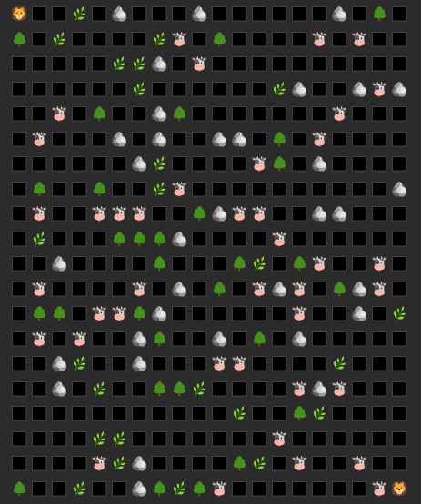

# Life-Simulation

## Overview
A 2D world simulation populated by herbivores and predators. In addition to creatures, the world contains resources (grass) that herbivores feed on, and static objects that cannot be interacted with - they simply occupy space.

Upon launching the game, a simulation field of size N by M is created with entities (subclasses of the Entity class). Subsequently, the actions of herbivores and predators, as long as there are herbivores, are defined in the Actions class. Grass appears as needed (when the existing grass is exhausted).

## Technical Specification
[Technical specification for the project](https://zhukovsd.github.io/java-backend-learning-course/Projects/Simulation/)

## Image of the initial state

## Game Rules
- Lions seek cows, reaching the target cell and attacking.
- All creatures have health reserves.
- Herbivores seek grass, approaching and instantly consuming it. However, they are defenseless against lions.
- Creatures have hunger, and if they go without food for a certain period, their health decreases.
- The game ends after the death of all cows or when there are no reachable goals.

## Pathfinding Logic
[Breadth-first search](https://en.wikipedia.org/wiki/Breadth-first_search) algorithm is implemented as pathfinding logic for getting the closest path to the closest goal.

## Symbols
- 🦁 Lion
- 🐮 Cow
- 🌿 Grass
- 🌳 Tree
- 🪨 Mountain
